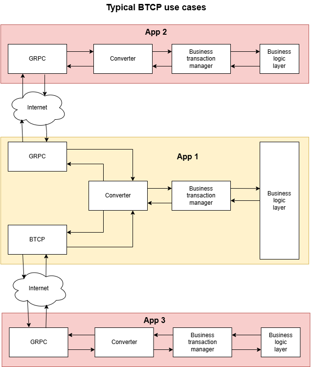
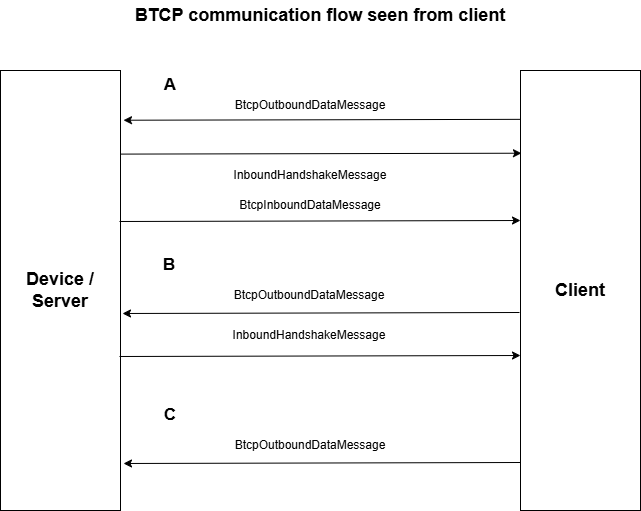
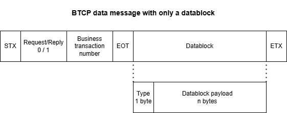

Business transaction communication protocol (BTCP)
==========================================

# Overview

Business transaction communication protocol (BTCP) is intended as a protocol to simplify the communication of a client and a backend.



A business transaction is a piece of business logic in the backend you can access remotely via business transaction (BT) number and pass parameters you want to deliver to this BT.

# Communication scheme



BTCP can basically be used fully duplexed. Means client and device/server can initially communication.

# Message format

A BTCP request message is structured as follows



[STX][0/1]NNN[EOT]UUID[EOT]XXX[ETX]

A BTCP reply message is structured as follows

STX1NNNEOTUUUEOTXXXETX


STX     Message start (0x2)

0       Request (0x1)

1       Reply (0x1)

NNN     Business transaction number encode as ASCII 0 - 9 (hex 0x38 - 0x39). Use as much digits as you require. Number ends with following EOT.

EOT     End of business transaction number (0x4)

UUID     A uniqueidentifier ([IETF RFC 4122 Version 4 Universally Unique Identifier (UUID)](https://datatracker.ietf.org/doc/html/rfc4122#section-4.4)) as UTF8 string like 0f8fad5b-d9cb-469f-a165-70867728950e

XXX     Minimum 0 bytes of payload. No maximum length defined by BTCP. First byte of payload as char is used to indentity the type of payload. If the message is a BTCP reply the payload content contains as first part a general section delivering error code, info message and error message as UTF8 string separated by a pipe (|). Additionally there may be added more payload data bytes separated with from first part with a pipe. Details see below.

ETX     End of message (0x3)

# BTCP request datablock format

The datablock on a BTCP request starts with an identifier byte for the payload. Use char 'x' for the BasicInboundDataBlock or BasicOutboundDataBlock or define your own datablocks with own codecs for it.

After the identifier byte there may follow any bytes defined by the purpose of your business transaction


# BTCP reply datablock format

The reply datablock starts with error code, info message and error message. Info message and error message may be empty but the separator pipe for them is always provided. After the error message follow another pipe and then the payload used for the business transaction. This payload may be empty too but the separator pipe for it is always provided.


# BTCP data messages

There are the following predefined data messages:

-   *BtcpInboundDataMessage*

-   *BtcpOutboundDataMessage*

For handshakes there are the following predefined messages:

-   *InboundHandshakeMessage*

-   *OutboundHandshakeMessage* 

# BTCP and order managment

For the BTCP protocol there are the following order builder. Each order builder represents a order type:

-   *BtcpOrderBuilder*: expecting handshake and answer

-   *NoAnswerBtcpOrderBuilder*: expecting handshake

-   *NoHandshakeNoAnswerBtcpOrderBuilder*: expecting neither handshake nor answer


``` csharp

```