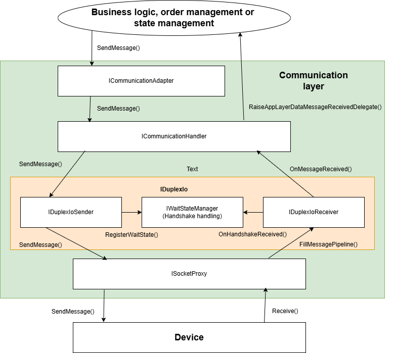
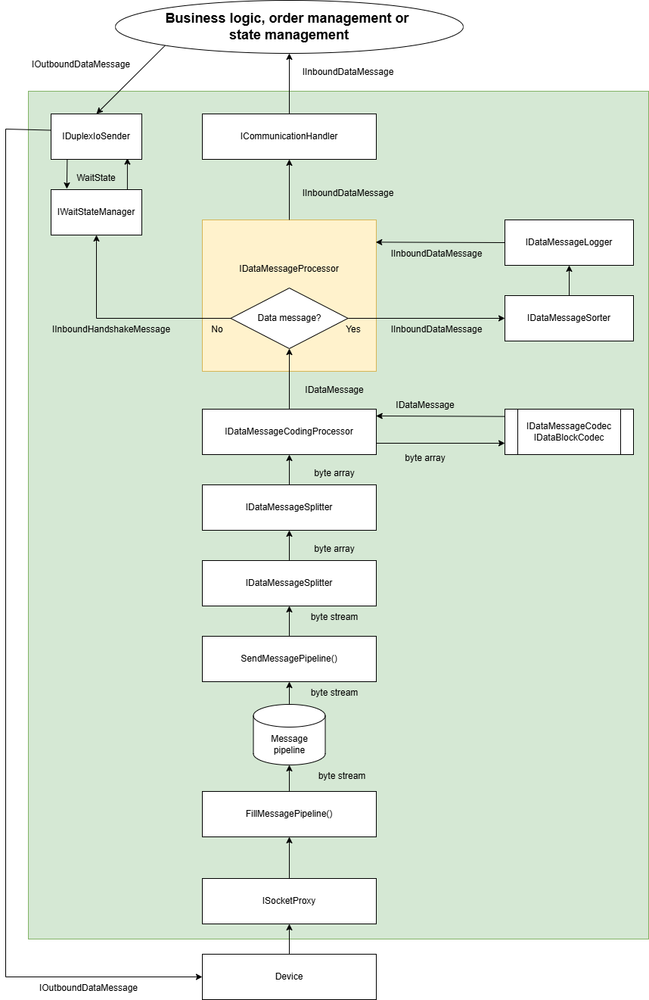

Communication layer details
=========================

# Overview

The communication layer is responsible for sending typesafe message classes as byte data to a device via TCP/IP or UPD and for receiving byte data from device via TCP/IP or UPD and deliver them to higher app levels as typesafe classes.

# Main interfaces

## ISocketProxy

The communication layer is based on four implementations of ISocketProxy related to IP protocol:

-   TcpIpServerSocketProxy: use it to implement a simple TCP/IP server

-   TcpIpClientSocketProxy: use it to implement a simple TCP/IP client

-   UdpServerSocketProxy: use it to implement a simple UDP server

-   UdpClientSocketProxy: use it to implement a simple UDP client

ISocketProxy is intended to abstract away the difficulties of socket management.

## IDuplexIoReceiver

ISocketProxy is consumed on the next level from IDuplexIoReceiver for receiving inbound messages and IDuplexIoSender for sending outbound messages.

## IDuplexIoSender

The job of this interface is to send outbound messages to the device via ISocketProxy low level interface.

## IDuplexIo

IDuplexIo is a container handling IDuplexIoReceiver and IDuplexIoSender.

## ICommunicationHandler

This interfaces is intended to bind the communication layer with the first layer of the business logic (ICommunicationAdapter). It abstracts the details of message communicatio  and network protocols away for business logic.

# Use cases for communication layer

## Simple commmunication layer usage

The simple version of a network communication layer does not employ order management and state management:

Accessing the communication layer directly from your business logic may work in simple use cases. As soon as you need to know the state your device and your app are in at the moment you should order and state management.

## Communication layer usage combined with order and state management

Normally you will have to employ order management and state management to keep a correct workflow in your app. With state management you can keep track with the current state the device and your app are in. The order management sends requested actions as data messages to the device and waits for an answer (if required).

To get all this working you have to set up your IDataMessageProcessingPackage implemetation carefully at the end and inject it to IDuplexIo via ctor injection via your IDataMessagingConfig instance. The following documentation shows how to do that step by step.

# Implementation of the communication layer

Design targets for this library are 

-	staying highly flexible

-	providing performant and efficient implementations

-	being unit testable

Basic principles of data communication used in Bodoconsult.Network

-   Resource efficient implementation

-   RAM usage cares

-   Garbage collector usage cares

-   Inbound communication separated from outbound communication on message and datablock level at least

-   Main classes unit tested as far as possible

Don't be surprised you will find rarely byte arrays in the code. MS says byte arrays are too slow for network communication and invented an underlying low level data model which much more efficient regarding memory consumption and garbage collection. One of the new classes is Memory<byte> which is the underlying base of byte[].

