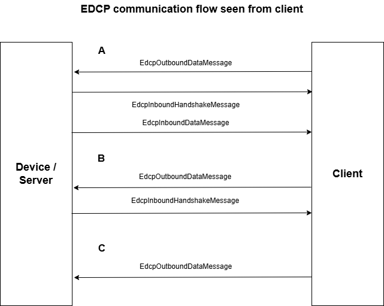
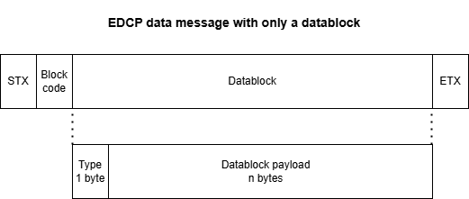

Enhanced data communication protocol (EDCP)
==========================================

# Overview

Basically the EDCP protocol is same as SDCP protocol but the second byte of each message is a a block code. Client and server use different number ranges for the block code. Let's say server uses block codes from 1 to 20 and client from 21 up to 40. If each party answers a received data message with a handshake it adds the block code received with the data nessage. So the sender of a data message can recognize the handshake received for the sent message clarly.

Another enhancement of EDCP protocl is byte 3 may contain a block code of a requesting data message. This enhancement makes it possible to implemenent data message requests answer by the other side by one or more data messages. If there is no block code for byte 3 delivered it means a data message sent without a request from the other side.


# Communication scheme



EDCP can basically be used fully duplexed. Means client and device/server can initially start communication.

# Message format

A EDCP request message is structured as follows:



[STX][BlockCode][BlockType]XXX[ETX]

The content of a data message is a datablock with the first byte indicating the type of datablock. The rest of the datablock is the payload.

Requests and replies are structured the same way. The only difference is: a reply gets the block code of the request.

*[STX]*:     Message start (0x2)

*[BlockCode]*: blockcode

*[BlockType]*: One byte as datablock type identifier

*XXX*: A minimum 0 bytes of additional payload. No maximum length defined by EDCP.

[ETX]     End of message (0x3)

# EDCP data messages

There are the following predefined data messages:

-   *EdcpInboundDataMessage*

-   *EdbcInboundHandshakeMessage*

-   *EdcpOutboundDataMessage*

-   *EdbcOutboundHandshakeMessage* 

# EDCP and order managment

For the EDCP protocol there are the following order builder. Each order builder represents a order type:

-   *EdcpOrderBuilder*: expecting handshake and answer

-   *NoAnswerEdcpOrderBuilder*: expecting handshake

-   *NoHandshakeNoAnswerEdcpOrderBuilder*: expecting neither handshake nor answer

``` csharp

```