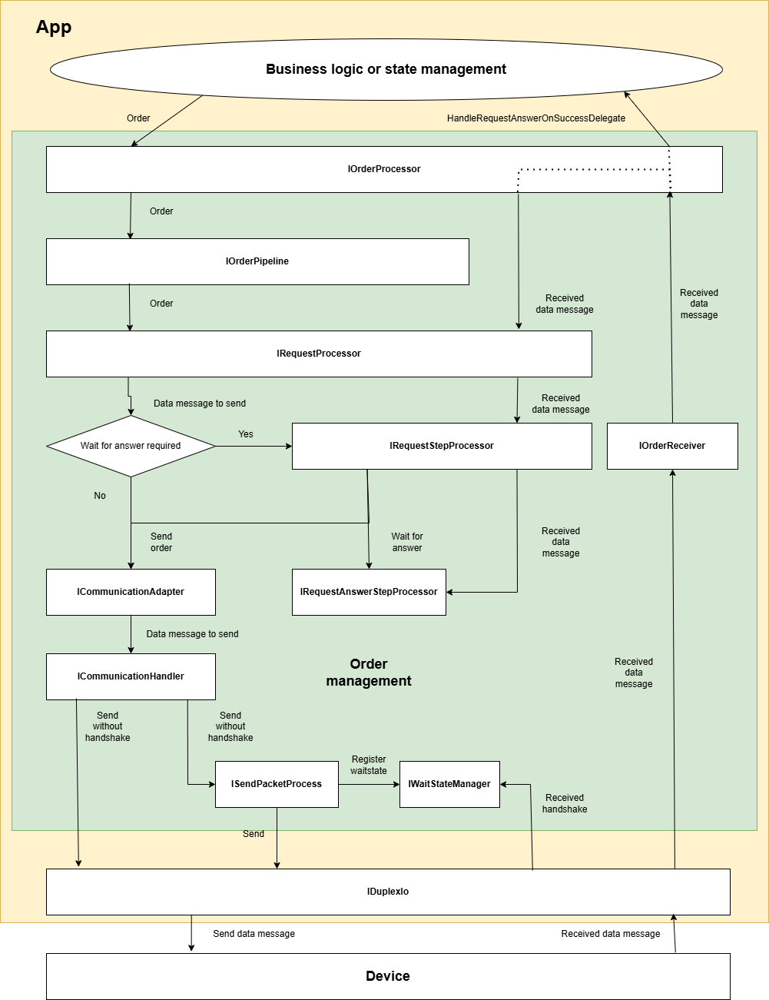

Order management
=====================================

# Overview

# Requirements

## Basic order types

The base class for orders is **OmOrder** class implementing IOrder interface.

Different order types will be configured by IOrderBuilder instances based on BaseOrderBuilder.

Basically there are 3 main types of orders the current implementation can handle:

-   Orders sending data to the device and waiting for handshake and answer (i.e. SdcpOrderBuilder)

-   Orders sending data to the device and waiting for handshake (i.e. NoAnswerSdcpOrderBuilder)

-   Orders sending data to the device only (i.e. NoHandshakeNoAnswerSdcpOrderBuilder)

## Order running modes

- Order running in an async non blocking mode (default)

- Order running in a sync blocking mode

# Order management process

