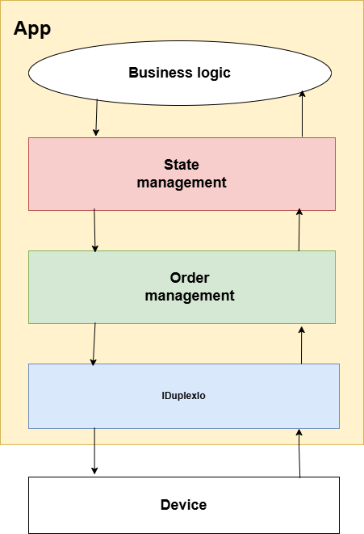
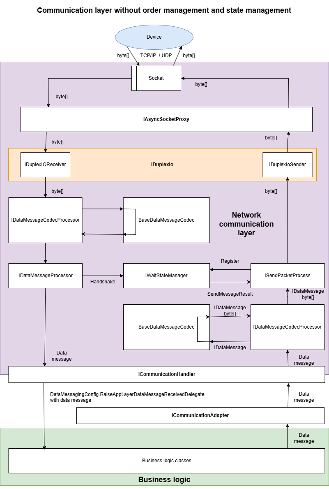
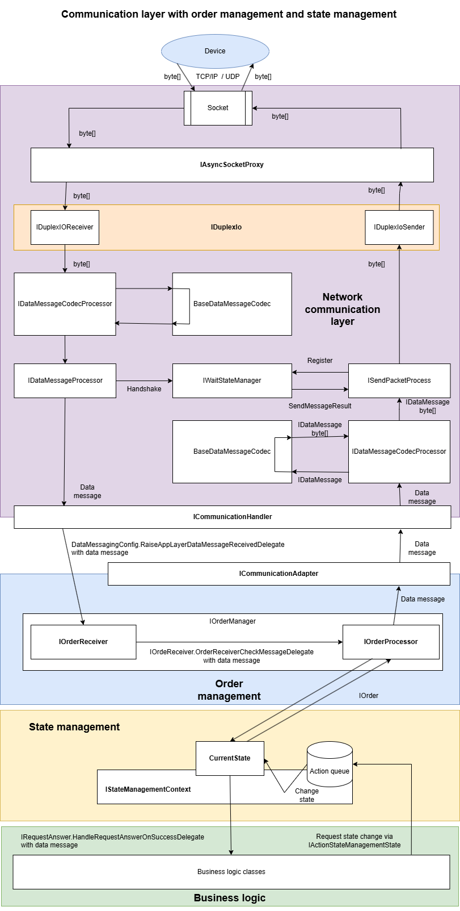
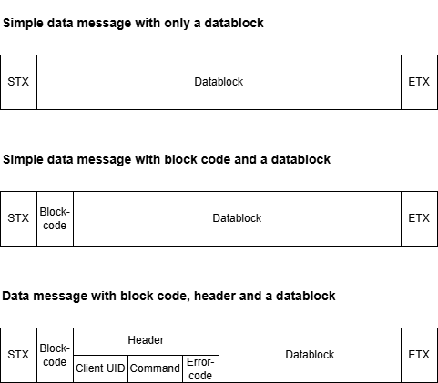

Bodoconsult.NetworkCommunication
==============

# What does the library

Bodoconsult.NetworkCommunication is a library with basic functionality for setting up a client server network communication based on TCP/IP and a self-defined low level byte message protocol. 

>	[Network communication overview](#network-communication-overview)

>	[Some remarks to the implementation](#some-remarks-to-the-implementation)  

>	[Defining your device communication protocol](#defining-your-device-communication-protocol)

>	[&#8618; Order management](OrderManagement.md)

>	[&#8618; State management](StateManagement.md)

>   [More information](#more-information)

For more information regarding the protcolos like BTCP or TNCP see:

>	[&#8618; Simple data communication protocol SDCP](SDCP.md)

>	[&#8618; Enhanced data communication protocol EDCP](EDCP.md)

>	[&#8618; Business transaction communication protocol BTCP](BTCP.md)

>	[&#8618; Telnet communication protocol TNCP](TNCP.md)

>	

>	

>	

# How to use the library

The source code contains NUnit test classes the following source code is extracted from. The samples below show the most helpful use cases for the library.

# Network communication overview

The basic idea of this library is sending message to the device as byte array (outbound message) and receiving messages from the device as byte array (inbound message).

Internally all messages sent or received are a implementation of IDataMessage. There are two basic classes of messages: handshake messages and data messages. 

Handshake messages are used to sent acknowledgements to the client or wait for ackknowledgement from client for sent message.

Data messages are all other types of messages transporting all kinds of data as your protocol defines it.

## Simple commmunication layer

The simple version of a network communication layer does not employ order management and state management:

## Communication layer with order and state management

Normally you will have to employ order management and state management to keep a correct workflow in your app. With state management you can keep track with the current state the device and your app are in. The order management sends requested actions as data messages to the device and waits for an answer (if required).

To get all this working you have to set up your IDataMessageProcessingPackage implemetation carefully at the end and inject it to IDuplexIo via ctor injection via your IDataMessagingConfig instance. The following documentation shows how to do that step by step.

# Some remarks to the implementation

Don't be surprised you will find rarely byte arrays in the code. MS says byte arrays are too slow for network communication and invented an underlying low level data model which much more efficient regarding memory consumption and garbage collection. One of the new classes is Memory<byte> which is the underlying base of byte[].

Design targets for this library are 

-	staying highly flexible

-	providing performant and efficient implementations

-	being unit testable

# Principles of data communication used in Bodoconsult.Network

-   Resource efficient implementation

-   RAM usage cares

-   Garbage collector usage cares

-   Inbound communication separated from outbound communication on message and datablock level at least

# Defining your device communication protocol 

Defining a client server network communication protocol may contain for Bodoconsult.NetworkCommunication the following steps:

-	**Choosing message delimiters**: how to identify a message in a stream of bytes? Default is STX as message start and ETX char as message end.

-	**Data message** versus **handshake**: A data message contains any data your business logic will normally react on. A handshake is a simple answer to the other side: yes I got your data message (ACK) or not (NACK).

-	**The message content**: Defining the general content of a data message. Does a data message require a kind of header to be delivered always containg data like device ID or error codes or not?

-	**Datablock content**: This the important data delivered mainly to your business logic on both side of the communication. The prupose of your communication protocol defines the data structures of the datablocks needed for your protocol.

## Example 1: Simple Device Communication Protocol (SDCP)

For the usage in this documentation there will be implemented the following Simple Device Communication Protocol (SDCP).

The SDCP knows two basic types of messages:

- **Data messages** starting with STX char and ending with ETX char. Everything between STX and ETX is handled as datablock. It is up to you to define IDataBlockCodecs to give the transported bytes a meaning.

- **Handshakes**: a 1-byte-message with either ACK (message received successfully), NACK (message NOT received successfully) or CAN (device not ready) sent when a data message was received.

The content of a data message is a datablock with the first byte indicating the type of datablock.

Each data message received will be answered by a handshake. 

The SDCP protocol is very simple but of limited usage in reality. The main drawback of SDCP are the missing identification of data message and its coresponding handshake.

See [&#8618; Simple data communication protocol SDCP](SDCP.md) for details!

## Example 2: Enhanced Device Communication Protocol (EDCP)

Basically the EDCP protocol is same as SDCP protocol but the second byte of each message is a a block code. Client and server use different number ranges for the block code. Let's say server uses block codes from 1 to 20 and client from 21 up to 40. If each party answers a received data message with a handshake it adds the block code received with the data nessage. So the sender of a data message can recognize the handshake received for the sent message clarly.

Another enhancement of EDCP protocl is byte 3 may contain a block code of a requesting data message. This enhancement makes it possible to implemenent data message requests answer by the other side by one or more data messages. If there is no block code for byte 3 delivered it means a data message sent without a request from the other side.

The repo Bodoconsult.NetworkCommunication contains a full implementation of EDCP protocol.

See [&#8618; Enhanced data communication protocol EDCP](EDCP.md) for details!

## Example 3: Business Transaction Communication Protocol (BTCP) 

See [&#8618; Business transaction communication protocol BTCP](BTCP.md) for details!

## Example 4: Telent Communication Protocol (TNCP) 

See [&#8618; Telnet communication protocol TNCP](TNCP.md) for details!

## Further potential enhancements

### Other message delimiters

Instead of STX and ETX you can use other message delimiter chars.

## Adding a general data message header

Instead of handling everything between STX and ETX as a datablock you can decide to start every message with a defined header containing a device ID, a request command, error codes, a device state and then after the header follows a data block with a certain purpose and its own definiton.

Adding a general data message header may reduce the implementation effort as you more the implementation from each data block code to the more general message code.

# Steps required to setup your network communication protocol

>	[&#8618; Setting up messaging configuration: IDataMessagingConfig](SDCP.md#setting-up-messaging-configuration-idatamessagingconfig)

>	[&#8618; Define message limiting bytes: DeviceCommunicationBasics](SDCP.md#define-message-limiting-bytes-devicecommunicationbasics)

>	[&#8618; Implement a data message splitter splitting the incoming byte stream into potential messages: IDataMessageSplitter](SDCP.md#define-message-limiting-bytes-devicecommunicationbasics)

>	[&#8618; Implement your data message types for inbound messages](SDCP.md#implement-your-data-message-types-for-inbound-messages-iinbounddatamessage)

>	[&#8618; Implement your data message types for outbound messages](SDCP.md#implement-your-data-message-types-for-outbound-messages-ioutbounddatamessage)

>	[&#8618; Implement a handshake validator for inbound handshakes: IHandshakeDataMessageValidator](SDCP.md#implement-a-handshake-validator-for-inbound-handshakes-ihandshakedatamessagevalidator)

>	[&#8618; Implement a data message validator for inbound data messages: IDataMessageValidator](SDCP.md#implement-a-data-message-validator-for-inbound-data-messages-idatamessagevalidator)

>	[&#8618; Implement a message forwarder for received messages: IDataMessageProcessor](SDCP.md#implement-a-message-forwarder-for-received-messages-idatamessageprocessor)

>	[&#8618; Implement the message codecs to decode and encode to byte array: BaseDataMessageCodec](SDCP.md#implement-the-message-codecs-to-decode-and-encode-to-byte-array-basedatamessagecodec)

>	[&#8618; Datablock coding processor: IDataBlockCodingProcessor](SDCP.md#datablock-coding-processor-idatablockcodingprocessor)

>	[&#8618; Implement your messaging package: IDataMessageProcessingPackage](SDCP.md#implement-your-messaging-package-idatamessageprocessingpackage)

# More information

[&#8618; https://csharp-networking.com/chapter01/](https://csharp-networking.com/chapter01/)

# About us

Bodoconsult <http://www.bodoconsult.de> is a Munich based software company from Germany.

Robert Leisner is senior software developer at Bodoconsult. See his profile on <http://www.bodoconsult.de/Curriculum_vitae_Robert_Leisner.pdf>.

