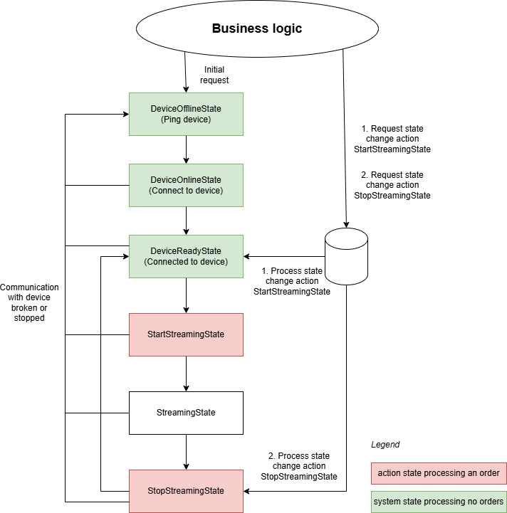
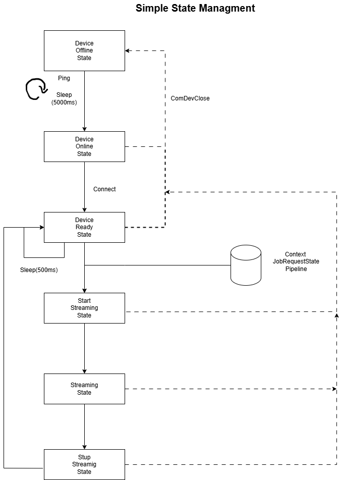

State management
========================================

# Overview

The state management is responsible for always knowing the state the device and your app are in. It handles requests to change state coming from business logic / UI. It has to check if a state change request is appropriate for the current state.

# A typical state management workflow

# A simple state management

