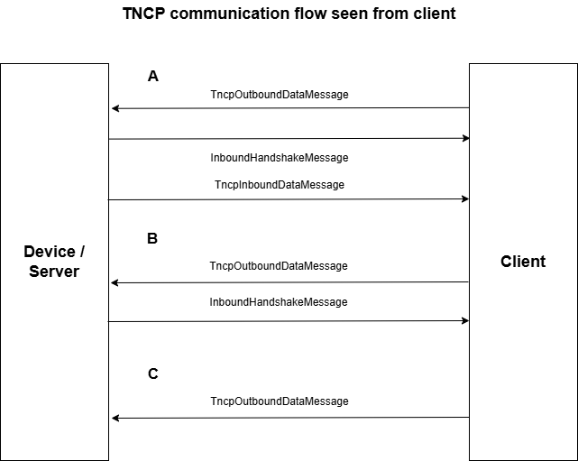
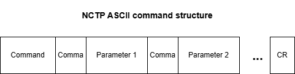

Telnet communication protocol (TNCP)
==========================================

# Overview

Telnet communication protocol is a IP based protocol sending commands nearly the same way as from a telnet console. This should help to simplify accessing telent enabled devices via TCP/ID by using the same command parser on the device side.

# Communication scheme



TNCP can basically be used fully duplexed. Means client and device/server can initially start communication.

# Message format

A TNCP messages are structured as follows:



Command [,] Parameter1 [,] Parameter2 [,] Parameter 3 ... [CR]

There is no difference between a request and a reply. 

No blanks allowed in the whole message.

*Command*:   Minimum 1 byte of command. No maximum length defined by TNCP. Command is interpreted as ASCII string. If it contains commas, the first token is interpreted as command, the rest of the tokens as parameters for this command. If there are no commas the whole string is interpreted as command.

*Parameter 1 - n*: Minimum 1 byte of parameter. No maximum length defined by TNCP. Parameters are interpreted as ASCII string

*[,]*     Comma (0x2c)

*[CR]*     Carriage return (0xd)

Sample:

``` text
log,chstat[CR]
```

# TNCP data messages

There are the following predefined data messages:

-   *TncpInboundDataMessage*

-   *InboundHandshakeMessage*

-   *TncpOutboundDataMessage*

-   *OutboundHandshakeMessage* 

# TNCP and order managment

For the TNCP protocol there are the following order builder. Each order builder represents a order type:

-   *TncpOrderBuilder*: expecting handshake and answer

-   *NoAnswerTncpOrderBuilder*: expecting handshake

-   *NoHandshakeNoAnswerTncpOrderBuilder*: expecting neither handshake nor answer


``` csharp

```